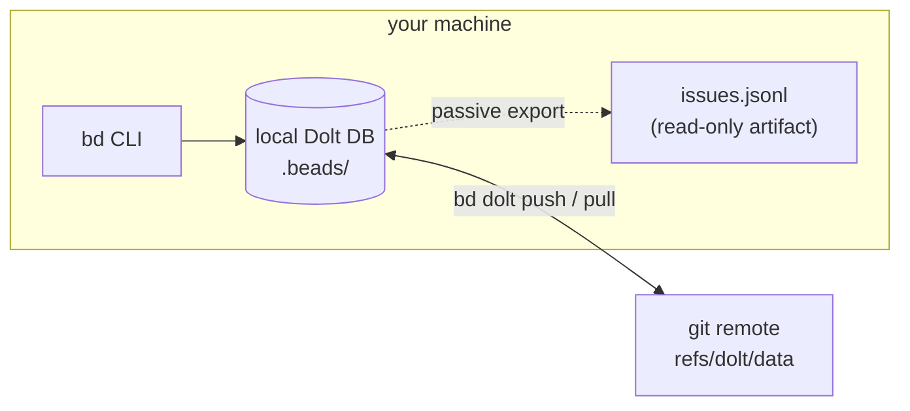

# Beads (`bd`) — the issue tracker, for humans

> The agent-facing rules live in the managed blocks of `AGENTS.md` / `CLAUDE.md`,
> and the canonical runtime reference is whatever `bd prime` prints. This page is
> the **human manual**: the mental model, the handful of commands you actually
> type, and the sharp edges we've hit. Upstream deep-dive:
> [SYNC_CONCEPTS](https://github.com/gastownhall/beads/blob/main/docs/SYNC_CONCEPTS.md).

## Why it exists here

Every unit of work — feature, bug, harness change — gets a bead **before code is
written**, and agents close beads as part of finishing. That gives a solo,
agent-heavy repo the two things markdown TODOs can't: a **dependency graph**
(`bd ready` = the frontier of unblocked work, which is also what the
orchestrator dispatches from) and **cross-session persistence** (a fresh agent
runs `bd prime` and inherits the state, memories included).

## Architecture in one picture

Three facts fall out of this picture:

- **The Dolt DB is the truth.** `issues.jsonl` is a passive export for grep and
  diffs — never edit it, never treat it as the source.
- **Sync rides your existing git remote** on a special ref (`refs/dolt/data`) —
  no extra service, no server. `bd dolt push` / `bd dolt pull` move it.
- **All worktrees share one DB.** A bead closed in one session is closed
  everywhere instantly; there is nothing to merge locally.

## The commands you actually type

| Want | Command |
|---|---|
| What can I (or the fleet) work on? | `bd ready` |
| The story of one issue | `bd show <id>` |
| File work | `bd create --title="…" --description="…" --type=task\|bug\|feature --priority=2` |
| Take it / finish it | `bd update <id> --claim` · `bd close <id> --reason="…"` |
| Block A on B | `bd dep add <A> <B>` (A depends on B) |
| What's stuck, what's stale | `bd blocked` · `bd stale` · `bd orphans` |
| Decisions waiting on **you** | `bd human` (list / respond / dismiss) |
| Cross-session memory | `bd remember "…"` · `bd memories <keyword>` · `bd forget <key>` |
| Sync with the remote | `bd dolt pull` · `bd dolt push` |
| Health check | `bd doctor` · `bd stats` |

Priorities are `0–4` (0 = critical), not words. Don't use `bd edit` — it opens
`$EDITOR` and hangs any agent that calls it.

## `bd human` — the human-decision queue (premise-gate wiring)

`bd human <id>` flags an issue as **waiting on a human ruling** and is how the
premise gate escalates: a `premise-reviewer` RETHINK verdict, a tripped kill
criterion mid-build, or any guardrail hard-stop lands here instead of being
"resolved" by an agent. Check the queue with `bd human`; your ruling (including
an informed override — first-class, see `skills/grill-me` Round 0) unblocks the
work and leaves the decision on the record.

## What Beads is NOT (the boundaries)

- **Not the learnings store for orchestrated runs** — fleet-operational facts go
  to `log-learning` / `learnings.jsonl` (the orchestrator reads those at
  startup). Beads is the **work graph**.
- **Not run state** — that's `.orchestrator/state.json`.
- **Not a prompt registry** — prompts and tool definitions live in git files,
  PR-reviewed (steering §4).
- `bd remember` **is** the right place for durable cross-session insights
  ("we evaluated tool X, verdict AVOID, because…") — one key per topic, updated
  in place, never a second copy in a markdown memory file.

## Multi-session, worktrees, and the lock (a sharp edge we hit)

The shared Dolt DB takes a lock per operation. Normal interleaved use from a few
sessions is fine — contention shows up as a **hang at 0% CPU**, not an error.

**Incident (2026-09-14, ticket `yxr`):** the eval runner shelled out to headless
`claude -p` from the repo cwd; each spawn ran this repo's `bd prime`
SessionStart hook, which piled dozens of `bd` processes onto the lock held by
the live session — multi-minute stalls and a recursive process cascade. Fixed
structurally (the model seam now runs the CLI from a neutral cwd), but the
lesson generalizes: **anything that spawns headless Claude inside this repo will
run the `bd prime` hook.** Spawn from a neutral directory, or expect contention.

If `bd` hangs: look for pile-ups with `ps aux | grep "bd prime"`, and clear
orphans with `pkill -f "bd prime --hook-json"` — they're read-only priming
calls; killing them loses nothing.

## Sync & the conservative profile

Agents do **not** run `bd dolt push` (or `git push`) on their own — the
conservative profile has them report and wait for authority (see "Agent Context
Profiles" in `AGENTS.md`). As the human, sync when you care about the remote
copy: `bd dolt pull` when starting on another machine, `bd dolt push` after a
work session. `bd doctor` diagnoses a diverged ref.

## Session close (what "done" includes)

Agents follow the close protocol from `bd prime`: close finished beads, run the
gate, `git status`, hand off. If an agent said "done" and `bd list
--status=in_progress` disagrees, the handoff was incomplete — that mismatch is
the thing to ask about.
