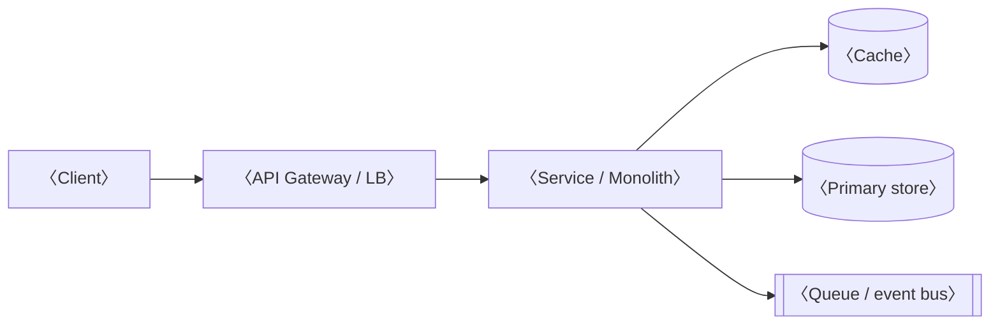

# Software Architecture Design Doc — Template & Playbook

> A reusable template for writing a software architecture design doc, fused with the decision frameworks from `docs/architecture-patterns-FULL-KB.md`.
>
> **How to use this:** copy this file, rename it for your project, and fill in every `〈angle-bracket〉` placeholder. Delete the `> GUIDANCE` blocks once you've used them — they're scaffolding, not content. Delete whole sections that don't apply (most docs don't need all of them; see Lynch's rule below).
>
> **Two structural sources, deliberately fused:**
> - **Section skeleton** — Michael Lynch, *How to Write an Effective Software Design Document* (refactoringenglish.com). The order and the "what's the penalty for being wrong?" discipline come from here.
> - **Decision frameworks** — the `docs/architecture-patterns-FULL-KB.md` (referenced below as **KB §x**). Wherever a section requires an architectural judgment, the relevant KB framework is inlined so you make the call with the framework in front of you.
>
> **The one rule that governs the whole doc (Lynch):** *What's the penalty for being wrong?* Document the decisions that are expensive or impossible to reverse (language, storage engine, service boundaries, sync-vs-async, auth model). Don't burn review cycles on decisions you can change in an afternoon (a "Load more" button, which email provider). If a choice is cheap to reverse, leave it out.

---

## Should you even write this doc?

> GUIDANCE — Lynch's trigger test. Write the doc if you answer "yes" to any of these; it's almost certainly worth it at two or more:
> - Will multiple people coordinate to implement this?
> - Will it take more than ~3 months of full-time work?
> - Will it run in production for years?
> - Does it involve cross-team collaboration?
> - Are the goals/requirements ambiguous?
> - Are there catastrophic risks (security, legal, data-loss) you could prevent at design time?
>
> If none apply, the right amount of design doc may be zero. Match the depth to the risk — a one-pager and a 50-page multi-team signoff are both valid outputs of this template.

---

## Title

**〈ProjectName〉**

> GUIDANCE — short, distinctive, evocative; easy to say aloud (Lynch). "RecencyBank" for a caching layer, not "Project Flying Silver Horse." This is what people will call it in standup.

---

## Metadata

- **Author:** 〈Name〉 (〈email〉)
- **Status:** 〈Draft / Ready for review / Approved / Implemented〉
- **Created:** 〈YYYY-MM-DD〉
- **Last updated:** 〈YYYY-MM-DD〉
- **Authoritative URL:** 〈go/shortlink or repo path〉
- **Reviewers:** 〈names / teams whose signoff is required〉

---

## Objective

> GUIDANCE — one sentence, plain language, understandable by any stakeholder. Belongs on the first page. State the *purpose*, not the mechanism.

〈One sentence: what this project does and the value it produces. e.g. "Reduce p50 page-load latency by adding a read-through cache between the API and Postgres."〉

---

## Background

> GUIDANCE — context and motivation. Answer: Why now? What problem does this solve? Were there prior attempts? Assume some readers see this before you've explained anything verbally — everything they need to follow the doc goes here or earlier.
>
> KB framing to bring in here: name the **pillar(s) under pressure** (KB §0.5). Every architecture decision trades along five axes — Reliability/Availability, Scalability, Maintainability/Evolvability, Performance, Cost — plus two cross-cutting constraints, Observability and Security, that you don't trade away. The background should make clear *which pillar is failing today* and is forcing this work, because that's the pillar your design optimizes for.

〈2–4 paragraphs. The situation today, the measured problem (numbers if you have them), what's been tried. End by naming the pillar(s) this project optimizes for and what it knowingly trades against — no pattern wins on all five.〉

---

## Related documents

> GUIDANCE — link out so reviewers can find context. Test plans, functional specs, design docs for related/predecessor systems, the relevant KB sections.

- 〈Test plan: …〉
- 〈Related/predecessor design doc: …〉
- **Pattern reference:** `docs/architecture-patterns-FULL-KB.md`
- **Worked example of the complexity ladder:** see *Appendix B — Worked Example: Climbing the Ladder One Forced Step at a Time* (end of this doc). A concrete file-storage system evolved rung by rung; use it as a model for how to justify each step up in your own Architecture Overview · A.
- 〈Prior-art / RFC / incident report that motivated this: …〉

---

## Goals

> GUIDANCE — high-level, stated as *impact* on users/team/company, never as implementation detail (Lynch). "Minimize deploy-related outages," not "Add Kubernetes." Should follow logically from Background and describe the world after implementation.

- 〈Goal stated as impact〉
- 〈Goal stated as impact〉

---

## Non-goals

> GUIDANCE — explicitly fence off what a reader might *assume* is in scope but isn't. This is where you prevent scope creep and the "why didn't you also…" review thread. Phrase each as the tempting-but-excluded thing plus one line of why it's out.

- 〈Tempting adjacent thing〉 — out of scope because 〈reason / "v2"〉.
- 〈…〉

---

## Glossary

> GUIDANCE — define internal tool names and domain terms a newer teammate or partner team wouldn't know. Best practice is to define inline so readers don't jump around; use this section for terms used repeatedly. If you use KB pattern names (Saga, CQRS, Strangler Fig, Hexagonal), link them to the KB rather than re-defining.

- **〈Term〉:** 〈definition〉
- **〈Internal tool〉:** 〈what it is and why it appears in this doc〉

---

## Scenarios

> GUIDANCE — narrate how the finished system behaves in the real world, as concrete walkthroughs. One numbered story per important flow. This is where reviewers catch "that's not what I meant" before any code exists.

**Scenario: 〈name〉**
1. 〈Actor does X〉
2. 〈System responds with Y〉
3. 〈…〉

**Scenario: 〈failure / edge case〉**
1. 〈…〉

---

## Architecture overview

> GUIDANCE — this is the heart of the doc and the part the KB exists to support. Work through the decisions below *in order*; each one constrains the next. Record not just what you chose but the cheaper option you rejected and why — that's the "penalty for being wrong" audit trail.

### A. Complexity rung (KB §0.7 — don't default to distributed)

> Pick the lowest rung that solves the problem, and name the specific failure mode that pushes you up — "because Netflix" is not a reason. Each step up roughly *doubles* operational complexity. The modular monolith is the rung most teams should pick and skip past; you can extract a service later when you genuinely need to.
>
> | Rung | Architecture | Pushes you up when… |
> |---|---|---|
> | 0 | Single script/process | multiple users; need uptime; deploy pain |
> | 1 | Monolith | build/test/deploy time blocks the team; conflicting release cadences |
> | 2 | Modular monolith | genuine need for independent scaling or deploys of specific modules |
> | 3 | Service-oriented (a few services) | finer-grained independence; >~5 service-owners |
> | 4 | Microservices | many teams, many cadences, real polyglot/scaling heterogeneity |
> | 5 | Serverless/FaaS | spiky workloads, no-ops mandate, glue between services |

**Chosen rung:** 〈e.g. "Rung 2 — modular monolith"〉
**Why not the rung below:** 〈the specific failure mode of the cheaper rung〉
**Why not the rung above:** 〈the complexity tax you're declining to pay〉

> WORKED EXAMPLE — For a fully narrated walk *up* this ladder (single script → load balancer → gateway/microservices → event broker → caching/CDN/rate-limiting), each step triggered only by a named failure mode, see **Appendix B**. Its governing rule — "gradual evolution: avoid over-engineering, make intentional progress" — is the same discipline as Lynch's "penalty for being wrong" and is the best short answer to "how do I know I picked the right rung?"

### B. Paradigm (KB §0.8 — OO / FP / hybrid)

> Most modern systems are hybrid: a primary paradigm that borrows from the other. The single most useful organizing idea is **Functional Core, Imperative Shell** (KB §0.8.4) — pure business logic over immutable data, wrapped in a thin I/O layer. It maps directly onto the layering in section C and gives you most of the testability wins for free (KB §1B).

**Primary paradigm:** 〈OO / FP / hybrid〉, organized as 〈e.g. "functional core, imperative shell"〉.
**Rationale:** 〈language norms, team familiarity, problem shape〉.

### C. Internal structure (KB §1, §1A — how code is organized inside a deployable)

> Choose the structural pattern *inside* each deployable. These compose with the rung above — a monolith can be internally layered; a microservice can be internally hexagonal.
> - **Layered / n-tier (KB §1.1):** default for CRUD-shaped systems; watch for business logic leaking across layers.
> - **MVC (KB §1.3):** the web-framework default (Rails/Django/Spring).
> - **Hexagonal / Ports & Adapters + DDD (KB §1.4, §1A):** for complex domain logic; dependencies point inward toward the domain; pairs with vertical-slice module organization (KB §1A.8). Powerful but overkill for simple CRUD (KB §1A.11).
>
> Mind the **three levels of pattern** (KB §0.6) so reviewers don't talk past each other: *architecture style* (system-wide shape) vs *architecture pattern* (component-level, e.g. Saga/CQRS/Circuit Breaker) vs *design pattern* (GoF, class-level). "Use the Adapter pattern" means different things at different levels.

**Internal structure:** 〈chosen style〉
**Module boundaries:** 〈how the system is sliced — by feature/bounded-context, or by technical layer〉

### D. Component patterns (KB §3–§8 — pull in only what the design needs)

> Reference the specific KB patterns this design uses, each with a one-line "why." Don't list patterns you aren't using. Common pulls:
> - **Data (KB §3):** CQRS, Event Sourcing, Saga, Sharding, Outbox, Materialized View, Database-per-Service.
> - **Communication (KB §4):** Pub-Sub, Request-Reply, API Gateway, Backend-for-Frontend.
> - **Reliability (KB §5):** Circuit Breaker, Rate Limiting, Bulkhead, Retry w/ backoff, Timeout, Fallback.
> - **Evolution (KB §6):** Strangler Fig, Anti-Corruption Layer, Branch by Abstraction, Parallel Run.
> - **Optimization (KB §7):** CDN, Cache-Aside, Write-Through/Behind, Read Replicas.
> - **Deploy (KB §8):** Blue-Green, Canary, Feature Flags, Shadow Traffic.
>
> Avoid the §10 anti-patterns (distributed monolith, etc.). If unsure, walk the §11 picking workflow.

- **〈Pattern〉 (KB §x):** 〈why this design uses it〉
- **〈Pattern〉 (KB §x):** 〈why〉

---

## Diagrams

> GUIDANCE — you can see the architecture in your head; reviewers can't. Draw it. At minimum: how data flows, how components fit together, how the system talks to dependencies and clients. Use an *editable* tool (Excalidraw, draw.io, Mermaid, D2, Graphviz) — never a photo of a whiteboard you can't revise. Link the source so others can edit it. Mermaid embeds cleanly in markdown:

**Editable source:** 〈link to the .excalidraw / draw.io / mermaid file〉

---

## Interfaces

> GUIDANCE — the system serves people or other software; show those contact points. UI: simple sketches only, don't bikeshed pixels. Software: API/CLI semantics, the actual signatures or endpoints. File-based: the format. Prefer real interface/type signatures — they pin down the contract precisely. (Lynch's example introduces a `Store` interface that the new component implements and the old code now depends on — the interface *is* the design.)

〈API endpoints / interface or type signatures / CLI surface / message schemas / file formats. Show the contract, not the implementation.〉

---

## Dependencies / infrastructure

> GUIDANCE — language(s), runtime hardware/service, where persistent data lives, key third-party packages. Lynch's discriminator: weight your attention by *how hard each dependency is to change later*. Language and storage backend are near-irreversible (high penalty for being wrong — argue these carefully). An email-sending vendor swaps out in an afternoon (low penalty — one line). Cross-ref KB §2A for where code physically runs (scaling vocabulary, load balancers, DB scaling, edge vs region, elastic vs reserved capacity).

- **Language:** 〈lang〉 — 〈why; how reversible〉
- **Runtime / hosting:** 〈where it runs; KB §2A.4〉
- **Persistent storage:** 〈engine〉 — 〈why; this is high-penalty, justify it〉
- **Key third-party packages:** 〈lib — what it gives you〉
- **Low-stakes / easily-swapped deps:** 〈vendor — one line, deliberately not over-specified〉

---

## Service level objectives (SLOs)

> GUIDANCE — measurable, objective targets so "performant" can't mean different things to you and your manager. Cover uptime/availability, latency, and scale. These connect to the pillar you named in Background (KB §0.5) — your SLO is how you prove you optimized for it.

- **Availability:** 〈e.g. 99.9% monthly〉
- **Latency:** 〈e.g. p50 ≤ 200 ms, p95 ≤ 800 ms for user-facing requests〉
- **Scale / throughput:** 〈e.g. sustains 2k req/s; 10× headroom before re-architecting〉

---

## Monitoring / alerting

> GUIDANCE — how you measure the SLOs in production. Answer: if the service goes down, how do you find out? If it slows 100×, how do you know? What else should page someone? KB treats **Observability** as an enabler pillar (KB §0.5) — design it in from day one; the audit surface and the control surface are the same surface. If this design crosses into agentic territory, observability must capture the *decision path*, not just I/O (KB §0.9.5).

**These events page the on-call engineer:**
- 〈SLO-breach condition, e.g. p95 latency ≥ 3s sustained 5m〉
- 〈resource condition, e.g. DB CPU ≥ 90% over 2m〉
- 〈error-rate / auth-failure spike condition〉

---

## Security

> GUIDANCE — integrate security at design time, not after (KB §0.5 treats it as a non-negotiable cross-cutting constraint; if you're trading "secure" against "scalable," an earlier decision was wrong). Answer Lynch's three questions, backed by the KB §5A toolkit:
> - **Threats considered?** 〈brute-force, malicious upload, injection — see OWASP Top 10, KB §5A.11〉
> - **Attack surface?** Where does the system process potentially-malicious data?
> - **Trust boundaries?** Where does data cross from less-privileged to more-privileged? (Browser→server is always one.)
>
> KB §5A decisions to record where relevant: **AuthN** pattern (§5A.1), **session vs token** (§5A.2), **authorization model** — RBAC/ABAC/ReBAC/etc. (§5A.3), **policy engine** if externalized (§5A.4, e.g. OPA), **Zero Trust** stance (§5A.5), **defense in depth** layering (§5A.6), **data protection** at rest/in transit (§5A.7), **secrets management** (§5A.8).

〈Threat model, attack surface, trust boundaries, and the §5A choices above. Even "we judged X out of scope because…" is worth recording — it invites reviewers to catch what you missed.〉

---

## Privacy

> GUIDANCE — the sensitive data the system touches and how it's safeguarded. What sensitive data? Retained how long? Who can access it? Encrypted at rest and in transit? A caching/derived-data layer typically *inherits* the privacy policy of its source of truth — say so explicitly.

〈Sensitive data handled, retention, access controls, encryption posture, inherited policies.〉

---

## Legal / compliance considerations

> GUIDANCE — include if you operate in a regulated domain (finance, health) or if things going wrong could create legal exposure. Note contractual constraints on data handling. If open-sourcing, state the license and why. KB §5A.9 lists compliance frames worth knowing. Delete this section if genuinely not applicable.

〈Regulatory frame, contractual data constraints, license choice — or "N/A; no regulated data or external contracts touched."〉

---

## Logging

> GUIDANCE — design for the incident you'll investigate later. What critical events get logged? What log levels? Where are logs stored, retained how long, accessible to whom? What sensitive data must be kept *out* of logs (cross-ref Privacy/Security)?

**Events logged:**
- 〈init parameters + host resource snapshot〉
- 〈state-mutation failures〉
- 〈cache-invalidation / consistency failures〉
- **Kept out of logs:** 〈PII / secrets / tokens〉

---

## Constraints

> GUIDANCE — hard limits imposed by budget, clients, infra, or dependencies that explain *why* the design looks the way it does. (e.g. "all hosts are RISC-V, so every dependency must build for RISC-V.") This is where you justify otherwise-surprising choices up front.

- 〈Constraint and what it forces〉
- 〈…〉

---

## Timeline

> GUIDANCE — milestones that each produce a *useful artifact* a stakeholder can react to (Lynch). Sequence for incremental, verifiable results — e.g. ship the UI with dummy data first so you learn you misread requirements *before* building the plumbing. Each milestone deploys something checkable.

- **Milestone 1 (〈date〉):** 〈smallest end-to-end slice; may use hardcoded/dummy data〉
- **Milestone 2 (〈date〉):** 〈real data path wired up〉
- **Milestone 3 (〈date〉):** 〈lifecycle/edge rules enforced〉
- **Milestone 4 (〈date〉):** 〈production rollout〉

---

## Open issues

> GUIDANCE — appendix for unresolved problems. Don't hide them; surfacing them is what gets you useful review. Each entry: the problem, the options, the immediate next step. Honest cost estimates (dev-days) make the tradeoff legible.

**Open Issue: 〈title〉**
- **Problem:** 〈what's unresolved and why it matters〉
- **Options:** 〈A vs B vs C, with the tradeoff〉
- **Proposed direction:** 〈your lean, if you have one〉
- **Next step:** 〈the concrete action — "ask tech lead," "run one load test," etc.〉

---

## Resolved issues

> GUIDANCE — when an open issue closes, summarize the decision and move it here, keeping the full original discussion below the decision for posterity. Future-you will want to know *why*.

**Resolved Issue: 〈title〉**
- **Decision:** 〈what was decided and the one-line rationale〉
- **Original discussion:** 〈the moved open-issue text〉

---

## Alternatives considered

> GUIDANCE — pre-empt "why didn't you do X?" A few brief lines per strong alternative and why it lost is enough — don't write an essay on every rejected idea. Especially worth recording alternatives that *seemed* appealing or that you researched at length. This is also the natural home for "why not the rung above/below" (section A) and "why not the other paradigm/pattern" if those debates were substantial.

- **〈Alternative〉:** 〈why it was rejected — the dealbreaker, briefly〉
- **〈Alternative〉:** 〈…〉

---

## Driving the doc through review

> GUIDANCE (process, not content — delete before publishing): share early, gather feedback, and steer toward decisions rather than bikeshedding. Use the "penalty for being wrong" frame to keep review focused on the irreversible choices. Lynch's companion piece on eliciting useful feedback is the follow-on read.

---

### Appendix: section-to-KB cross-reference

| Doc section | KB framework that drives it |
|---|---|
| Background, SLOs | §0.5 Five Pillars (name the axis you optimize) |
| Architecture overview · A | §0.7 Ladder of Complexity |
| Architecture overview · B | §0.8 Paradigm Choice / Functional Core, Imperative Shell |
| Architecture overview · C | §1, §1A Structural patterns, DDD + Hexagonal; §0.6 pattern levels |
| Architecture overview · D | §3–§8 component patterns; §10 anti-patterns; §11 picking workflow |
| Dependencies / infrastructure | §2A Hosting, scaling, load distribution |
| Monitoring | §0.5 Observability enabler; §0.9.5 decision-path observability (if agentic) |
| Security | §5A Security architecture & access control |
| Alternatives considered | §0.6, §0.7, §11 (record the rejected rung/pattern) |
| **Appendix B (worked example)** | §0.7 Ladder in motion; §2A, §3.7, §4, §5, §5A, §7 as each rung demands |

---

## Appendix B — Worked Example: Climbing the Ladder One Forced Step at a Time

> This appendix is a *teaching example*, not part of any single project's doc — copy the reasoning pattern, not the contents. It narrates one system (a file-storage / "cloud drive" backend: upload a file, store it, serve it back) evolving from a single process to a distributed system. The point is **not** the final architecture. The point is that *every* jump is triggered by a specific, named failure of the rung below — never by "because that's how big systems look."
>
> **Source & adaptation:** distilled from *Fundamentals of Backend Architecture — How to Design Scalable Software* (SelfMadeEngineer, selfmadeengineer.com; YouTube `Qa-7iWxDz1A`), reconciled with the companion whiteboard in `backendsystemdesign.excalidraw`. Section/pattern references (KB §x) point into `docs/architecture-patterns-FULL-KB.md`. The talk's own thesis, quoted from the first panel of its diagram: **"gradual evolution → avoid over-engineering and intentional progress."** That single line is why this example belongs next to Architecture Overview · A (KB §0.7, the Ladder of Complexity).

### B.0 How to read this appendix

Each stage below has the same four parts, and you should reproduce exactly this shape when you justify a rung in your own doc:

1. **What we have** — the current architecture, at the lowest rung that was working.
2. **The question that breaks it** — the specific, concrete failure the video forces at each step ("what happens when the server dies?", "what happens if the Thumbnail service is down?"). This is Lynch's "penalty for being wrong" asked *forward*.
3. **The smallest step that answers it** — one rung, one pattern, nothing more.
4. **The new cost you just took on** — every step up roughly doubles operational complexity (KB §0.7); name the tax so it's an *intentional* purchase, not an accident.

### B.1 Stage 0 — A single process, data coupled to the machine

**What we have.** One server process. Uploaded files live in a map in memory / on the local disk of that one box (`type app struct { files map[string]string }`). A user uploads to `POST /api/upload`; the same process serves them back. It works, and for a demo it is *correct* — do not skip past it out of embarrassment. This is Rung 0 (KB §0.7).

**The question that breaks it.** *What happens when the server dies?* and *what happens when you want to scale?* Both have the same root cause, and the video names it precisely: **data coupled to the machine = no scale, no resilience.** If the bytes live on that host, the host is now a single point of failure and you cannot add a second identical host — the two would disagree about what files exist.

**The smallest step that answers it → B.2.**

**The tax.** None yet — recognizing the coupling is free. The tax starts at the next step.

### B.2 Stage 1 — Split state out: a database, then object storage

**The step.** Pull state off the compute box. Two different kinds of state get two different homes, and conflating them is a classic early mistake:

- **Structured metadata** (filename, size, type, owner, id) → a **relational database**. Small, queryable, transactional. `POST /api/files` writes a row like `{ "id": "123", "filename": "car.png", "size": 400000, "type": "png" }`.
- **The file bytes themselves (the "blob")** → **object storage** (S3-style), *not* the relational DB and *not* the local disk. The blob and the row are stored separately and linked by id. The video is blunt about the failure mode of getting this wrong: pushing a large file *through* your app server ("direct upload") is what produces `413 Payload Too Large` or `504 Timeout`.

**Why this specific split.** Now the server is **stateless** (KB §2A). Any request can be served by any server instance because no instance owns the data. Statelessness is the precondition for *everything* above this line — you cannot horizontally scale a box that holds the only copy of the state.

**The tax.** You now operate a database and an object store, and you have your first consistency seam: a row can exist without its blob, or vice-versa. (Hold that thought — it's what forces the broker in B.5.)

### B.3 Stage 2 — More traffic than one box can serve: horizontal scale + a load balancer

**The question that breaks it.** One stateless server is fine until one stateless server isn't — CPU/RAM/storage on a single box (`vertical` scaling) has a ceiling and a price curve that goes vertical. *How do you serve more concurrent users than one machine can hold?*

**The step.** Go **horizontal** (KB §2A): run N identical stateless servers and put a **load balancer** in front. The video's concrete knobs, worth stealing verbatim for your own infra section:

- **Autoscaling bounds** — `min=2, max=10`. `min=2`, never 1, so the balancer always has a healthy target during a deploy or a crash.
- **Health checks** — the balancer stops routing to a box that fails its probe. This is *how* you actually cash in the resilience you set up in B.1.
- **Distribution algorithm** — the default mental model is **round-robin**; the video lists the real menu: **Weighted Round Robin**, **Sticky Sessions / Session Affinity** (route a user back to the same box — a smell if you're truly stateless), and **Least Connections** as the pragmatic alternative when request cost is uneven.

**Vertical vs horizontal, stated as the doc should state it.** Vertical = bigger box, simplest, hard ceiling, single point of failure. Horizontal = more boxes, needs a balancer + statelessness, but scales past any single machine and tolerates a node dying. This is the KB §2A trade in one sentence; horizontal wins here *only because B.1–B.2 already made the servers stateless.*

**The tax.** A load balancer to run and configure; deployments now roll across a fleet; "which box served this?" becomes a real question (→ logging/observability).

### B.4 Stage 3 — One monolith serving everything becomes the bottleneck: split into services behind a gateway

**The question that breaks it.** The single application is now doing uploads, downloads, thumbnailing, auth, and realtime notifications. These have *different scaling shapes and different failure blast-radii*: thumbnailing is CPU-spiky and can fail without blocking a download; auth must never be the thing that falls over. Bundling them means you scale all of them to handle the peak of the greediest one, and a bug in one takes down all of them.

**The step.** Introduce an **API Gateway** (KB §4) as the single front door, and split the monolith into a few **services** by responsibility, each with its own concern:

- **Files** (upload/download orchestration, metadata)
- **Auth** (identity, tokens)
- **Thumbnail** (generate previews)
- **Realtime** (push notifications to clients)
- ...each addressable behind the gateway by **path-based routing** (`POST /upload`, `GET /api/files/{file_id}`, `POST /api/auth/login`), all inside a **VPC** so the services talk on a private network and only the gateway is exposed.

**Restraint, explicitly.** The video's diagram literally labels this panel **"MICROSERVICES"** — and this is the exact spot to re-read KB §0.7's warning. A *few* services split along real seams (auth vs files vs thumbnail) is Rung 3, "service-oriented," and is usually the right ceiling. Do **not** read this stage as license to shatter the system into dozens of nano-services; that's the distributed-monolith anti-pattern (KB §10). The seams here are load-bearing because each service genuinely differs in scaling and failure profile — that is the *only* justification that counts.

**The tax.** Network calls where you used to have function calls (latency, partial failure, serialization); a gateway to operate; per-service deploys and versioning; the beginnings of a distributed-systems debugging problem.

### B.5 Stage 4 — Synchronous cross-service calls are fragile: an event broker for fan-out

**The question that breaks it — the pivotal one in the whole talk.** When a file is uploaded, the Thumbnail service needs to make a preview. The naive wiring is: Files calls Thumbnail **synchronously** and waits. The video asks the three questions that should make you stop:

1. Does it *have* to be a sync call? (Does the uploader need the thumbnail *right now* to get their `200`?)
2. **Most importantly, what happens if the Thumbnail service is down or slow?** With a sync call, the upload fails or hangs — a non-critical feature (previews) is now able to break a critical one (uploads).
3. What if you later want to **fan this "event" out** to *other* services (search indexing, virus scan, notifications) that also care that a file arrived?

**The step.** Put a **message broker** between them and make the interaction **asynchronous / event-driven** (KB §4 pub-sub). The upload flow becomes: gateway verifies token → **Metadata service creates a row and returns an upload URL** → **client uploads bytes straight to object storage** (not through the app — this is the B.2 lesson enforced) → an **event** is published to the broker → **Thumbnail consumes the event, generates the preview, writes it back**. Other services subscribe to the same event independently.

**Why a broker, in the video's own four bullets** (put these in your doc when you justify async): the broker is **highly available**; messages are **durable** (survive a consumer being down); it supports **redelivery** (retry a failed consume); and it gives you **separation of concerns** (producers don't know who consumes). Now Thumbnail being down means previews are *late*, not that uploads *fail* — the failure is contained to the feature that failed.

**Consistency note (ties back to B.2).** The "write a row, then publish an event" pair is exactly the dual-write problem; the durable-and-transactional way to do it is the **Outbox pattern (KB §3.7)**. If your doc reaches this stage, name Outbox explicitly rather than hand-waving "and then we publish an event."

**The tax.** A broker to run; **eventual consistency** is now a user-visible fact (the file exists a beat before its thumbnail does); at-least-once delivery means consumers must be **idempotent**; and "trace one upload across five services and a queue" is now a first-class observability requirement, not a nice-to-have.

### B.6 Stage 5 — Auth done right at the edge: signed JWTs, verified at the gateway

**The question that breaks it.** Every service needs to know *who* is calling, but you do **not** want every service making a network call to Auth on every request — that makes Auth a synchronous dependency of the whole system (the exact fragility B.5 just removed) and a bottleneck.

**The step — three requests, in order, straight from the talk:**

1. **Requesting a token.** `POST /api/login` with credentials `{ "email": ..., "password": ... }`. On success, **Auth issues a signed JWT, signed with its private key.**
2. **Authenticated requests.** The client sends `Authorization: Bearer <jwt>` on *every* subsequent request. The **gateway verifies the JWT's signature + expiry using Auth's public key** — and critically, makes **no network call to Auth per request.** On success it injects a trusted header like `X-User-Id: 123` for downstream services; on failure it returns `401` right there. The payoff, in the video's words: **bad traffic dies at the edge and never touches the Files service.**
3. **File serving with least privilege.** To actually hand a file back, the service returns a **pre-signed URL** to object storage with a short **expiry** — e.g. `my-bucket.s3.us-west1.com/drive/cars.png?auth=123` — so the bytes stream directly from storage to the user, scoped and time-limited, without proxying through your compute again.

**Why this shape.** Asymmetric signing (private key signs, public key verifies) is what lets verification happen *anywhere* without consulting Auth — the same property that lets you push the check to the edge. This is KB §5A (AuthN, §5A.1; token-vs-session, §5A.2). Map it onto your Security section's trust boundaries: the gateway *is* the boundary where untrusted becomes trusted.

**The tax.** Key rotation and JWT expiry/refresh logic; revocation is genuinely harder with stateless tokens (a valid JWT is valid until it expires) — a real trade you must acknowledge, not paper over.

### B.7 Stage 6 — Stop recomputing the same read: caching, CDN, and the thing you must NOT cache

**The question that breaks it.** `GET /api/files/123` for a *popular* file runs the full stack — gateway → Files → relational DB → object storage → stream back — every single time. At 10k MAU, if 500 users open the same file every day, that's a lot of identical, wasteful compute. *Why pay for the same read 500 times?*

**The step — two different caches for two different things, and knowing which is which is the whole lesson:**

- **Cache the metadata in an in-memory store (Redis).** The `GET /api/files/123` path needs the row (id, filename, size, type). It's **tiny and rarely changes** — the textbook cache candidate. The **Cache-Aside** read (KB §7): *does key `file:123` exist in cache? → yes: return it. → no: get it from the DB, save it to cache, return it.*
- **Cache the file *bytes* at a CDN, not in Redis.** The video is emphatic here and you should quote the reasoning in your own doc: **putting a 20 MB video in Redis is usually wrong** — it's expensive RAM and Redis isn't built to stream large blobs. Blobs belong on a **CDN** (KB §7): hundreds of points-of-presence worldwide, so the first user in Lisbon to fetch file 123 pulls it once, the CDN caches it at the Lisbon edge, and the next ~499 Lisbon users get it from ~20 ms away with zero work from your origin.

**The rule to extract.** *Cache small, hot, rarely-changing structured data in RAM (Redis); cache large static blobs at the edge (CDN); don't cross the streams.* Choosing the wrong store for the object is the common, expensive mistake — the pattern is only as good as the match between the data's shape and the cache's shape.

**The tax.** Cache invalidation (the metadata row *does* occasionally change — stale reads are now possible); a CDN and a Redis cluster to operate; another consistency window to reason about.

### B.8 Stage 7 — Protect the system from abuse: rate limiting + alerting

**The question that breaks it.** Nothing above stops one user (or a botnet, or a runaway client) from hammering `GET /api/files/123` and exhausting capacity for everyone. Scaling *up* to absorb abuse is paying an attacker's bill.

**The step.** **Rate limiting** at the gateway (KB §5, reliability patterns): count requests per principal and reject over the threshold. The video's concrete shape — *user 123 → 5 requests* against a budget of *10 requests*; once the budget is exceeded, return **HTTP 429 (Too Many Requests)**. Pair it with **alerting**: push operational signals to a **broker → alerts → Slack** channel so a human finds out about abuse or SLO breaches without watching a dashboard. (This is the operational half of the Observability pillar, KB §0.5 — the alert path is as much a designed artifact as the request path.)

**The tax.** Choosing limits that stop abuse without throttling legitimate bursts; per-principal counters (usually in the same Redis you added in B.7); tuning what pages a human vs. what's just logged.

### B.9 The through-line — what to actually take from this

Read the stages back to back and the shape of good architectural judgment appears, which is the whole reason this example is in the doc:

- **Every rung was forced by a named failure of the rung below** — never by aspiration. "What happens when the server dies?" forced state-splitting; "what if Thumbnail is down?" forced the broker; "why pay for the same read 500 times?" forced caching. If you can't name the failure, you haven't earned the next rung.
- **The lowest rung that works is a valid answer.** Stage 0 is *correct* for a demo. Most systems should stop at a modular monolith or a small handful of services (Stages 2–4) and go no further. Stopping early is a *win*, not unfinished work — the exact point KB §0.7 makes and the template's Section A enforces.
- **Every step up roughly doubles operational complexity.** The "tax" line in each stage is not decoration; it's the price you're agreeing to pay, and it should appear in *your* Alternatives-Considered and Dependencies sections as an honest cost.
- **The tagline generalizes:** *gradual evolution — avoid over-engineering, make intentional progress.* That is the same instinct as Lynch's "penalty for being wrong" and belongs stapled to every rung decision you make in Architecture Overview · A.

### B.10 Stage-to-KB / stage-to-section cross-reference

| Stage | What forces it | KB pattern(s) | This doc's section |
|---|---|---|---|
| 0 · Single process | (baseline) | §0.7 Rung 0 | Arch · A |
| 1–2 · Split state (DB + object storage) | "server dies / can't scale"; data coupled to machine | §2A statelessness; §3 data patterns | Arch · A, Dependencies |
| 3 · Horizontal + load balancer | one box's ceiling; SPOF | §2A scaling, LB algorithms, health checks | Arch · A, Dependencies, SLOs |
| 4 · Services behind gateway | mixed scaling shapes / blast radius | §4 API Gateway; §0.7 Rung 3 (**not** §10 distributed monolith) | Arch · A, · C, · D |
| 5 · Event broker (async fan-out) | "Thumbnail down blocks upload"; fan-out | §4 pub-sub; §3.7 Outbox | Arch · D, Diagrams |
| 6 · JWT auth at the edge | per-request Auth call is a bottleneck | §5A.1 AuthN, §5A.2 token-vs-session | Security |
| 7 · Caching + CDN | recomputing hot reads; blob-in-Redis mistake | §7 Cache-Aside, CDN | Arch · D, SLOs, Dependencies |
| 8 · Rate limiting + alerting | abuse; no operational signal | §5 rate limiting; §0.5 Observability | Security, Monitoring |

**Editable source of the companion diagram:** `backendsystemdesign.excalidraw` (import at excalidraw.com to view/annotate the full whiteboard this example is drawn from).
