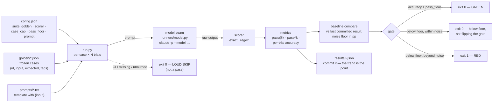

# The evaluation harness (`evals/`)

Evals are the test suite for the harness's non-deterministic components. Tests
assert; evals **score** — and the score gates merges the same way a failing
test does. This doc covers the runner that ships in `evals/`: what it is, how a
run works, how to read a result, and how to extend or port it.

Companion references: [`evals/README.md`](../evals/README.md) is the in-tree
cheat-sheet; [`skills/eval-harness/SKILL.md`](../skills/eval-harness/SKILL.md)
is the agent-facing procedure for *building* evals. This doc is the human-facing
manual for the runner as implemented.

## Design stance

- **Hand-rolled, stdlib-only, config-driven.** No framework, no dependencies —
  the whole runner is `run.py` plus four small modules under `runners/`. This is
  deliberate (recorded 2026-08-20): eval frameworks are a guardrail-3 dependency
  decision, and the hosted platforms (Braintrust, LangSmith, Langfuse, Arize)
  additionally ship prompts and tool arguments off-machine — a guardrail-2
  decision. The stdlib runner stays until it demonstrably fails.
- **One model seam.** The only place the harness touches an LLM is
  [`runners/model.py::call_model`](../evals/runners/model.py), which shells out
  to `claude -p`. Everything above the seam is deterministic and unit-tested
  with a mocked model (see `evals/tests/`). Swapping providers means swapping
  one function.
- **Honest unavailability.** A missing or unauthenticated CLI produces a LOUD
  "EVALS SKIPPED … this is not a pass" banner and exit 0 — never silent, never
  fake-green, and never red merely because the tool is absent. This is why CI
  (which has no `claude` CLI) can run the same gate script as local without
  lying in either direction.

## Anatomy of a run



For each golden case, the runner substitutes the case's `input` into the
suite's prompt template, calls the model N times (`trials`), scores each raw
output with the suite's scorer, and aggregates. The full result — per-case
trials, metrics, cost estimate, baseline verdict, gate verdict — is written to
`evals/results/<timestamp>-<suite>.json`. **Commit result files**: the newest
committed result is the baseline the next run compares against, and the
committed series is the regression trend.

## Directory layout

```
evals/
  config.json    # model, trials, noise floor, cost rates, suite definitions
  run.py         # the runner: python3 -m evals.run --suite <name>
  golden/        # frozen, versioned, APPEND-ONLY case files (*.jsonl)
  prompts/       # one prompt template per suite; {input} is the placeholder
  runners/
    loader.py    # config + golden validation (missing fields, duplicate ids)
    model.py     # THE model seam (claude -p); ModelUnavailable on any failure
    scorers.py   # exact + regex; judge scoring is a named extension point
    metrics.py   # pass@k / pass^k / per-trial accuracy, cost, noise floor
  results/       # timestamped scored runs — committed, they form the baseline
  tests/         # unit tests for everything above the seam (mocked model)
```

## Running it

```bash
python3 -m evals.run --suite smoke
```

```bash
python3 -m evals.run --suite full --trials 3
```

```bash
python3 -m evals.run --suite smoke --dry-run
```

- `--suite` (required): a key under `suites` in `config.json` — `smoke` or
  `full` today.
- `--trials N`: override the config's trial count for this run (agent-style
  suites want N > 1; see the statistics section).
- `--dry-run`: validate config, golden file, and prompt template without a
  single model call. Cheap enough to run anywhere; this is what proves a suite
  is well-formed before you pay for tokens.
- `--config PATH`: point at another config (used when porting the runner).

Exit codes: `0` green, below-floor-but-within-noise, or loud skip · `1` gate
red · `2` config/golden validation error or unknown suite.

### Where it runs automatically

`.claude/gate.sh full` runs `python3 -m evals.run --suite smoke` as its last
step, after lint, format, tests, and coverage. The same script runs in three
places — local edit hooks (fast mode: lint only), local turn-end (full), and CI
on every PR ([`.github/workflows/gate.yml`](../.github/workflows/gate.yml)).
One script, one definition of done. CI has no `claude` CLI, so its eval step is
a designed loud skip; the *scored* smoke runs happen on authenticated dev
machines, and their committed results carry the trend.

## The golden set contract

One JSON object per line in `golden/<suite>.jsonl`:

```json
{"id": "wt-002", "input": "Add CSV export to the reports page", "expected": "feature", "tags": ["type:feature", "difficulty:easy"]}
```

- All four fields are required; duplicate `id`s are rejected at load time.
- **Frozen and versioned, append-only.** If the golden set moves under you,
  every regression comparison is meaningless. Fixing a genuinely wrong case is
  allowed — that's a reviewed diff — but rewriting cases to make a run pass is
  the eval equivalent of editing a failing test's assertion.
- **Seed from reality.** Cases come from real asks and real failures — every
  production bug becomes a golden case. That is how coverage is earned, and it
  is the same loop the observability skill feeds ("a repeated correction
  becomes a new gate").
- `tags` are free-form `key:value` strings for slicing results by type or
  difficulty; the runner carries them through to the result file.

The one shipped suite, **work-type-classification** (48 cases), scores the
classifier that routes asks to the orchestrator's 12 work types. Its prompt
template ([`evals/prompts/work-type-classification.txt`](../evals/prompts/work-type-classification.txt))
also demonstrates the harness's injection stance in miniature: the ask text is
declared DATA, and cases tagged `difficulty:adversarial` check that embedded
instructions don't steer the classification.

## config.json reference

| Key | Meaning |
|---|---|
| `model` | Model id passed to `claude -p --model …` for every suite |
| `trials` | Default trials per case (CLI `--trials` overrides per run) |
| `noise_floor_pp` | Delta vs baseline, in percentage points, below which a change is noise |
| `cost_rates_per_mtok` | `{model: {input, output}}` $/MTok table for cost estimates |
| `suites.<name>.golden` | Path to the suite's golden `.jsonl` |
| `suites.<name>.scorer` | `exact` or `regex` |
| `suites.<name>.case_cap` | Max cases per run — this is what makes `smoke` (12) cheaper than `full` (60) |
| `suites.<name>.pass_floor` | Per-trial accuracy below which the gate goes red |
| `suites.<name>.prompt` | Path to the prompt template |

The loader validates all of this up front (missing keys, unknown scorers) and
fails with exit 2 before any model call.

## Reading a result: the three metrics and the gate

For each case the runner records every trial's output and pass/fail, plus
`passed_any` and `passed_all`. Across the suite:

- **`per_trial_accuracy`** — total passing trials ÷ total trials. This is the
  number the gate and the baseline comparison use.
- **`pass_at_k`** — fraction of cases that passed *at least one* trial.
  Capability: "can it ever?"
- **`pass_pow_k`** — fraction of cases that passed *every* trial. Regression:
  "does it, reliably?" A 75%-per-trial agent passes 3-of-3 only ~42% of the
  time, so a "flaky regression" may just be arithmetic — which is why
  regression suites want pass^k and N > 1, while single-trial runs collapse all
  three metrics into one.

The gate verdict then combines the floor with the noise floor:

| Condition | Verdict | Exit |
|---|---|---|
| accuracy ≥ `pass_floor` | GATE GREEN | 0 |
| accuracy < floor, but within `noise_floor_pp` of the last committed result | below floor, **not flipping the gate** | 0 |
| accuracy < floor, beyond the noise floor | GATE RED (failing cases printed) | 1 |
| no committed baseline (first run) | floor alone decides | 0 or 1 |
| CLI missing or unauthenticated | LOUD SKIP — "this is not a pass" | 0 |

The noise-floor rule is the statistical honesty piece: a delta smaller than the
declared floor (3pp here, until this project measures its own variance via
repeated identical runs) is not evidence of anything and must not flip the
gate in either direction. The result's `baseline.verdict` states this in words:
"within noise, not a regression" / "this is a regression" / "improvement".

Costs in results are **estimates** — tokens ≈ chars/4, priced by the config
rate table. Good enough to see a 3× token bloat trend; never billing-grade.
Wall time is recorded per run. Track both: +2% quality for 3× tokens is a bad
trade.

## Extending it

**Add a case** — append a line to the suite's golden `.jsonl` (unique `id`),
run `--dry-run` to validate. This is the routine move after any production bug
or misrouted ask.

**Add a suite** — a golden file + a prompt template + a `suites` entry in
`config.json`. Nothing else; the runner is suite-agnostic. Pick the cheapest
sufficient scorer: schema check (`regex`) > `exact` > metric > LLM judge >
human.

**Add a scorer** — any `(output: str, expected: str) -> bool` callable
registered in `SCORERS` in [`runners/scorers.py`](../evals/runners/scorers.py),
plus the `KNOWN_SCORERS` tuple in `loader.py`.

**Judge scoring** — a *named extension point*, deliberately not built: no suite
needs it yet, and judge machinery is the most common eval-harness waste. When a
suite genuinely needs rubric scoring, the contract is already written down in
the scorers docstring: judge model ≠ producer model, reason-before-verdict,
and the judge validated against ~30–50 human-scored cases first — an
unvalidated judge makes every downstream number decoration.

**Swap providers / port to another project** — the runner is a template
deliverable: copy `evals/`, replace `golden/`, `prompts/`, and `config.json`
with the target project's suites, and (if not using the `claude` CLI) rewrite
the one function in `runners/model.py`. `setup-harness` ships it to new
projects.

## Operational rules, restated

1. A regression (beyond noise) **blocks the merge** — same rule as tests, no
   red merges.
2. Golden sets are frozen; results are committed; both are reviewed like code.
3. Prompts are code: the templates in `prompts/` change via PR, not in place.
4. A loud skip is not a pass — if your local runs keep skipping, run
   `claude /login` and re-run the gate; CI's skip is by design.
