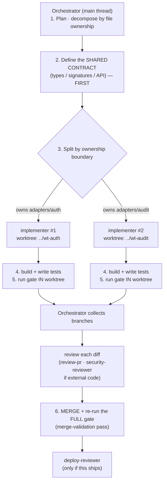

# Multi-agent orchestration in Claude Code

How to ship a multi-part change by running several agents **in parallel**, each
isolated in its own git worktree, then verifying and merging. This is the operational
companion to the [`orchestrate-agents`](../skills/orchestrate-agents/SKILL.md) skill —
read this for the diagram, exact commands, and a worked example.

> **One-line mental model:** *you* are the orchestrator (the main Claude Code thread);
> the workers are subagents; git worktrees keep them from stepping on each other; and
> nothing merges until you've validated the combined result.

---

## The flow



**The two steps people skip — and the whole point of the discipline:**
- **Step 2 (shared contract first).** If workers don't agree on the interface before
  they start, they build to different contracts and the merge is a rewrite.
- **Step 6 (merge-validation).** Each worker's gate passing *in isolation* does not
  prove the *combination* works. Re-run the full gate on the merged result. Always.

---

## The roster

| Agent | Role | Tools | Merges? |
|---|---|---|---|
| **you / main thread** | orchestrator: plan, contract, split, review, merge, validate | all | ✅ you do |
| [`implementer`](../agents/implementer.md) | build one owned slice in an isolated worktree | read/edit/write/bash | ❌ never |
| [`test-writer`](../agents/test-writer.md) | cover a slice with tests | read/grep/glob/write/bash | ❌ |
| [`security-reviewer`](../agents/security-reviewer.md) | BLOCK/ALLOW on external code/deps | read-only | ❌ |
| [`deploy-reviewer`](../agents/deploy-reviewer.md) | ship gate on the merged result | read-only | ❌ |

Spawn **one `implementer` per ownership boundary**. The reviewers are read-only by
design — a reviewer that can write is a reviewer you can't trust.

---

## The worktree workflow (exact commands)

A worktree is a separate working directory backed by the one shared `.git`, so two
agents can edit at the same time without touching the same file state.

```bash
# create one tree + branch per worker, off the same base
git worktree add ../wt-auth   -b feat/submission-auth
git worktree add ../wt-audit  -b feat/submission-audit

# ... an implementer works in each (see "How to invoke" below) ...

# after review, merge each branch, then VALIDATE the combination
git switch main
git merge --no-ff feat/submission-auth
git merge --no-ff feat/submission-audit
<run the full gate here>          # the merge-validation pass — non-negotiable

# clean up the trees
git worktree remove ../wt-auth
git worktree remove ../wt-audit
```

The `implementer` subagent declares `isolation: worktree` in its frontmatter, so when
you spawn it Claude Code gives each instance its own worktree automatically — you don't
have to create them by hand. The explicit commands above are the fallback (and what's
happening under the hood).

---

## How to invoke it in a Claude Code session

You don't need special tooling — you drive it in the main thread:

1. **Plan + contract, out loud:** *"We're adding auth and an audit log to the
   submission service. Here's the shared contract: `AuthResult`, `AuditEvent`, and the
   `record(event)` signature. Auth owns `adapters/auth/`; audit owns `adapters/audit/`.
   They don't share files."*
2. **Fan out:** *"Spawn two `implementer` agents in parallel, each in its own worktree —
   one for auth, one for audit — against that contract. Each writes tests and runs the
   gate in its tree."*
3. **Review as they return:** read each diff (not just the summary); run `security-reviewer`
   on anything external.
4. **Merge + validate:** *"Merge both branches and re-run the full gate on the result."*
   Then `deploy-reviewer` if it's shipping.

> **When to reach for this at all:** only when the work splits along **real file
> ownership boundaries** AND your review capacity can keep up. Practical cap is **~2–3
> parallel workers** — the bottleneck is *you reviewing*, not compute. Below that bar,
> a single sequential agent is faster and safer.

---

## Worked example: "submission triage" feature

The PRD (via `write-a-prd` → `prd-to-issues`) yields three tickets with clean boundaries:

| Worker | Owns | Contract it depends on |
|---|---|---|
| `implementer` #1 | `adapters/extract/` — PDF → fields | returns `ExtractedSubmission` |
| `implementer` #2 | `domain/rules/` — fields → risk summary | consumes `ExtractedSubmission`, returns `RiskSummary` |
| `implementer` #3 | `api/` — HTTP endpoint wiring | consumes both types |

Because all three depend on `ExtractedSubmission` / `RiskSummary`, you **define those
types first** (step 2) and hand them to every worker. #1 and #2 run fully in parallel;
#3 is lighter and can follow, or run in parallel against the agreed types and integrate
at merge. Merge → run the full gate → the combination is validated once, together.

---

## Guardrails (parallelism multiplies the surface)

- **No auto-merge, ever.** More workers = more error surface *and* more injection
  surface. Every diff is reviewed before it lands (guardrail-aligned; `review-pr`).
- **Workers stay in their lane.** An implementer editing outside its ownership boundary
  is a finding, not a convenience — it's how parallel workers corrupt each other.
- **No worker installs a dependency** on its own authority (guardrail #3); external
  code still goes through `secure-code-review`.
- **The merge-validation pass is the safety net.** Isolated-green ≠ combined-green.

---

## Advanced: when you want *deterministic* orchestration

The pattern above is model-driven (you decide, in the thread, what to fan out). When
you want the *control flow itself* to be deterministic and repeatable — fixed stages,
loops, fan-out over a known work-list, adversarial verify-then-synthesize — that's a
job for a **scripted workflow** rather than ad-hoc delegation. Keep as much of the
orchestration logic in code as possible and reserve model judgment for the steps that
genuinely need it (the steering doc's rule: deterministic control flow, observable
decisions). Reach for that only when the fan-out is repeated enough to earn a script.
