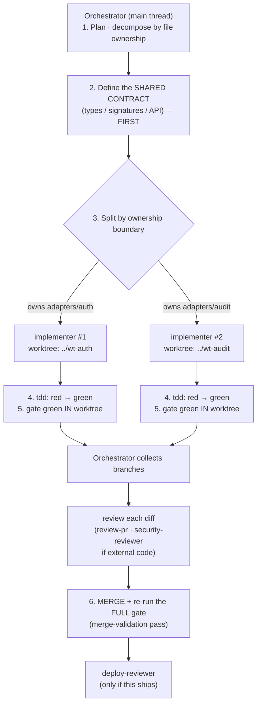

# Multi-agent orchestration in Claude Code

How to ship a multi-part change by running several agents **in parallel**, each
isolated in its own git worktree, then verifying and merging. This is the operational
companion to the [`orchestrate-agents`](../skills/orchestrate-agents/SKILL.md) skill —
read this for the diagram, exact commands, and a worked example.

> **One-line mental model:** *you* are the orchestrator (the main Claude Code thread);
> the workers are subagents; git worktrees keep them from stepping on each other; and
> nothing merges until you've validated the combined result.

---

## 0. Roles are OPERATIONAL, not an org chart

The design choice this whole doc rests on, stated first because it's the one that's
easy to get backwards.

| | Org-chart simulation (**don't**) | Operational roles (**this repo**) |
|---|---|---|
| Roles from | Human job titles — Analyst, PM, Architect, Dev | What the system needs — dispatch, implement, verify, merge |
| Flow | Sequential handoffs through phase gates | Parallel dispatch from a work graph |
| Gates | A model judges "is this phase done?" | Tests, gate scripts, git state |
| State | Carried in each agent's context through the handoff | External — the work graph and `.orchestrator/` |

**The tell you've built the wrong one:** the roles would still make sense if you
replaced every agent with a person. That's not a compliment — human phase gates exist
because humans have limited communication bandwidth and need accountability handoffs.
Agents don't have those constraints; they have a **context ceiling and no persistence**.
Copying the org chart imports the overhead without addressing either, then makes both
worse: long role personas eat the window, and handoffs are lossy and serial.

Our roles (`implementer`, `test-writer`, `security-reviewer`, `deploy-reviewer`) are
named for **what they do to the artifact**, not for a job title. Keep it that way.

---

## 1. The flow


```mermaid
flowchart TD
    A["Orchestrator (main thread)<br/>1. Plan · decompose by file ownership"] --> B["2. Define the SHARED CONTRACT<br/>(types / signatures / API) — FIRST"]
    B --> C{"3. Split by ownership boundary"}
    C -->|owns adapters/auth| D["implementer #1<br/>worktree: ../wt-auth"]
    C -->|owns adapters/audit| E["implementer #2<br/>worktree: ../wt-audit"]
    D --> D2["4. tdd: red → green<br/>5. gate green IN worktree"]
    E --> E2["4. tdd: red → green<br/>5. gate green IN worktree"]
    D2 --> F["Orchestrator collects branches"]
    E2 --> F
    F --> G["review each diff<br/>(review-pr · security-reviewer<br/>if external code)"]
    G --> H["6. MERGE + re-run the FULL gate<br/>(merge-validation pass)"]
    H --> I["deploy-reviewer<br/>(only if this ships)"]
```

**The two steps people skip — and the whole point of the discipline:**
- **Step 2 (shared contract first).** If workers don't agree on the interface before
  they start, they build to different contracts and the merge is a rewrite.
- **Step 6 (merge-validation).** Each worker's gate passing *in isolation* does not
  prove the *combination* works. Re-run the full gate on the merged result. Always.

---

## 2. The work graph (Beads) — where the frontier lives

**Beads (`bd`) is the tracker preset.** It exists so the ticket layer is deterministic
**data** rather than model-parsed prose — steering rule "deterministic control flow"
applied to tickets.

| Step | Command | Why it's the deterministic version |
|---|---|---|
| Read the frontier | `bd ready --json` | Membership in `bd ready` **IS** the ready-for-agent signal. No model decides what's ready |
| Assign | `bd update <id> --claim` | **Atomic** — two workers cannot take the same ticket. No double-dispatch |
| Publish work | `bd create` + `bd dep add` | Dependency edges hold tickets *out* of `ready` until their blocker closes |
| Discover mid-slice | `bd create` + `discovered-from` link | New work is filed, not lost in a worker's context |

**Why it matters here:** dependency edges are what let you fan out without a human
sequencing every ticket. Closing a blocker releases its dependents into the frontier
automatically — that's the dispatch loop, and it's data, not judgment.

> ### 🚧 BOUNDARY — Beads is the work graph ONLY
> Learnings stay in `learnings.jsonl`. Run state stays in `.orchestrator/`.
> **Never `bd remember`.** One memory store, not two — two stores holding overlapping
> facts is how an agent ends up confidently citing something the other store retired.

**Never run `bd setup claude` or its plugin.** Harness skills own the procedure — same
rule as the graphify install. Installing a tool's own agent integration hands it
authority over your context layer.

`GitHub Issues` remains the option when the tracker has to be **team-visible**; Beads
is preferred when the consumer is agents.

---

## 3. What actually caps the number of workers

Worktrees remove the *interference* limit. They do not remove the other two, and
people size fleets against the wrong one.

| Limit | Set by | Raised by |
|---|---|---|
| Interference | Shared files, ports, services | Worktrees + per-tree env — solved here |
| **Task independence** | Real file-ownership boundaries in the codebase | Decoupling. A tangled module caps you regardless of tooling |
| **Review capacity** | You, reading diffs | Risk lanes, machine pre-review, smaller slices — **usually binds first** |

> **Practical cap: ~2–3 parallel workers.** The bottleneck is *you reviewing*, not
> compute. Below that bar a single sequential agent is faster and safer.

**Sizing question:** not *"how many agents can I run"* but *"how many items are in
`bd ready` right now, and how many diffs can I actually review today?"* The smaller
number is the ceiling. Capacity above it converts a generation constraint into a
review backlog — you've spent money to make the bottleneck bigger. Idle workers still
burn tokens re-reading context.

---

## 4. The roster

| Agent | Role | Tools | Merges? |
|---|---|---|---|
| **you / main thread** | orchestrator: plan, contract, split, review, merge, validate | all | ✅ you do |
| [`implementer`](../agents/engineering/implementer.md) | build one owned slice in an isolated worktree | read/edit/write/bash | ❌ never |
| [`test-writer`](../agents/qa/test-writer.md) | cover a slice with tests | read/grep/glob/write/bash | ❌ |
| [`security-reviewer`](../agents/review/security-reviewer.md) | BLOCK/ALLOW on external code/deps | read-only | ❌ |
| [`deploy-reviewer`](../agents/review/deploy-reviewer.md) | ship gate on the merged result | read-only | ❌ |

Spawn **one `implementer` per ownership boundary**. The reviewers are read-only by
design — a reviewer that can write is a reviewer you can't trust.

---

## 5. The worktree workflow (exact commands)

A worktree is a separate working directory backed by the one shared `.git`, so two
agents can edit at the same time without touching the same file state.

```bash
# claim from the frontier first — atomic, so no double-dispatch
bd ready --json
bd update <id> --claim

# create one tree + branch per worker, off the same base
git worktree add ../wt-auth   -b feat/submission-auth
git worktree add ../wt-audit  -b feat/submission-audit

# ... an implementer works in each (see "How to invoke" below) ...

# after review, merge each branch, then VALIDATE the combination
git switch main
git merge --no-ff feat/submission-auth
git merge --no-ff feat/submission-audit
<run the full gate here>          # the merge-validation pass — non-negotiable

# close the ticket; its dependents drop into `bd ready` automatically
bd close <id>

# clean up the trees
git worktree remove ../wt-auth
git worktree remove ../wt-audit
```

The `implementer` subagent declares `isolation: worktree` in its frontmatter, so when
you spawn it Claude Code gives each instance its own worktree automatically — you don't
have to create them by hand. The explicit commands above are the fallback (and what's
happening under the hood).

---

## 6. How to invoke it in a Claude Code session

You don't need special tooling — you drive it in the main thread:

1. **Read the frontier:** `bd ready --json`. If it's empty, there is nothing to fan out
   and the answer is more decomposition, not more agents.
2. **Plan + contract, out loud:** *"We're adding auth and an audit log to the
   submission service. Here's the shared contract: `AuthResult`, `AuditEvent`, and the
   `record(event)` signature. Auth owns `adapters/auth/`; audit owns `adapters/audit/`.
   They don't share files."*
3. **Claim, then fan out:** claim each ticket (`bd update <id> --claim`), then *"Spawn
   two `implementer` agents in parallel, each in its own worktree — one for auth, one
   for audit — against that contract. Each builds **test-first** (`tdd`: failing test
   from its acceptance criteria, then minimal code) and runs the gate in its tree."*
4. **Review as they return:** read each diff (not just the summary); run
   `security-reviewer` on anything external.
5. **Merge + validate:** *"Merge both branches and re-run the full gate on the result."*
   Then `deploy-reviewer` if it's shipping. Close the beads.

---

## 7. Worked example: "submission triage" feature

The PRD (via `write-a-prd` → `prd-to-issues`) yields three tickets with clean boundaries:

| Worker | Owns | Contract it depends on |
|---|---|---|
| `implementer` #1 | `adapters/extract/` — PDF → fields | returns `ExtractedSubmission` |
| `implementer` #2 | `domain/rules/` — fields → risk summary | consumes `ExtractedSubmission`, returns `RiskSummary` |
| `implementer` #3 | `api/` — HTTP endpoint wiring | consumes both types |

Because all three depend on `ExtractedSubmission` / `RiskSummary`, you **define those
types first** (step 2) and hand them to every worker. #1 and #2 run fully in parallel;
#3 is lighter and can follow, or run in parallel against the agreed types and integrate
at merge. Merge → run the full gate → the combination is validated once, together.

**On Beads:** #3 gets a `bd dep add` edge on #1 and #2, so it never enters `bd ready`
until both close. The dependency graph enforces the ordering that would otherwise live
in your head.

---

## 8. Guardrails (parallelism multiplies the surface)

- **No auto-merge, ever.** More workers = more error surface *and* more injection
  surface. Every diff is reviewed before it lands (guardrail-aligned; `review-pr`).
- **Workers stay in their lane.** An implementer editing outside its ownership boundary
  is a finding, not a convenience — it's how parallel workers corrupt each other.
- **No worker installs a dependency** on its own authority (guardrail #3); external
  code still goes through `secure-code-review`.
- **The merge-validation pass is the safety net.** Isolated-green ≠ combined-green.
- **An abort must be recorded.** If a run stops on budget, error, or your interrupt,
  write the exit class and partial state before winding down — *an abort that isn't
  recorded becomes a success claim later.* Note the honest limit: the orchestrator
  **cannot kill a running subagent**; it stops dispatching, parks branches, and reports
  what exists. See `orchestrator_engine/abort.py`.
- **Long/overnight runs get a defect ledger** (`DEFECTS.md`, asymmetric writes: QA
  opens/closes, workers fix, orchestrator never codes) and the exit predicate
  "success criteria met AND every defect closed" — see the `orchestrate-agents`
  skill's *Long / autonomous runs* section.

> **These guardrails are REVIEW-ONLY.** They catch the careless case — most real
> incidents. A **compromised** agent is exactly the thing that won't run its own safety
> check, and adding a second model to check the first just moves the question. Real
> containment is enforced *outside* the agent: deny-by-default egress, a container with
> no host mounts and no cloud creds. See `HARNESS.md` and `secure-code-review` §6.

---

## 9. Why we did NOT adopt a fleet framework

Recorded so the decision isn't relitigated, and so an agent that reads about one of
these elsewhere knows the posture.

**Surveyed:** Gastown (`gastownhall/gastown`) — a Go workspace manager running 20–30
parallel agents, with real substrates worth learning from.

**Rejected — on posture, not capability.** Three defaults, individually defensible for
a throughput-maximizing system and collectively disqualifying here:

1. Runtimes default to `--dangerously-skip-permissions`.
2. Agents run **unsandboxed, as the user's UID** — inheriting shell env, cloud creds,
   and filesystem reach. There is no containment outside the agent.
3. **Autonomous merge to main.** Directly incompatible with our human-gated merge.

**Adopted — one component.** Beads, on its own merits (§2), after verifying the
package identity against the upstream repo and smoke-testing that dep edges gate
`ready`, that `--claim` is atomic, and that closing a blocker releases dependents.

**Parked, trigger = first real fleet run:** liveness heartbeats / witness,
session-death-as-routine resume, per-agent commit attribution.

> ⚠️ **Trigger risk:** "first real fleet run" is when you most *need* liveness
> detection, not when you want to start building it. If `bd` does not reap stale
> claims on its own, pull that one slice forward before the first fleet run.

**The reusable move:** survey the system, name the posture you won't take, extract the
component that stands alone, verify it, bound it, park the rest against a stated trigger.

---

## 10. Advanced: when you want *deterministic* orchestration

The pattern above is model-driven (you decide, in the thread, what to fan out). When
you want the *control flow itself* to be deterministic and repeatable — fixed stages,
loops, fan-out over a known work-list, adversarial verify-then-synthesize — that's a
job for a **scripted workflow** rather than ad-hoc delegation. Keep as much of the
orchestration logic in code as possible and reserve model judgment for the steps that
genuinely need it (the steering doc's rule: deterministic control flow, observable
decisions). Reach for that only when the fan-out is repeated enough to earn a script.

`orchestrator_engine/` is that layer here: state registry, budget caps, abort
wind-down, model routing, run ledger. **Everything in it is deterministic and testable
even though the model call at the center isn't** — which is what makes a
non-deterministic system debuggable.
