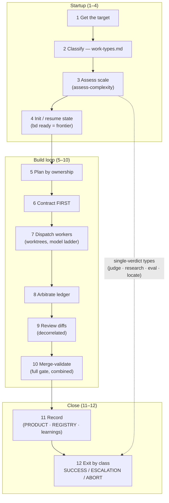
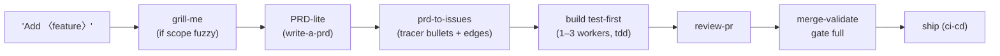
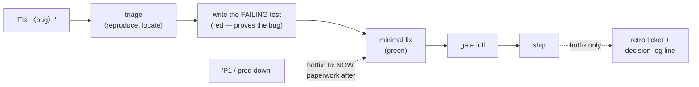
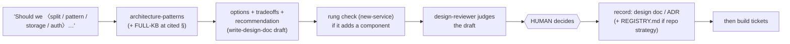
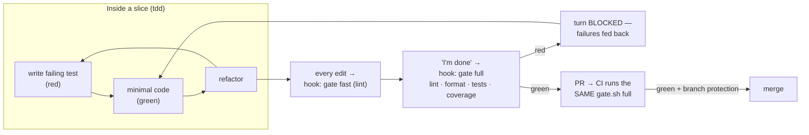

# Workflows — the common paths, drawn

> Diagrams of what actually happens for each kind of ask. The **taxonomy** lives
> in [`docs/agents/work-types.md`](./agents/work-types.md) and the **step
> sequence** in the orchestrator — this file only draws them. If a diagram and
> those files disagree, the files win.

## The orchestrator's 12-step spine (every managed run)

## Add a feature (Type A)

Small, well-understood feature? Skip straight from the ask to build — the
pipeline is for non-trivial work (the escape valve).

## Fix a bug (Type B) — and the hotfix variant

One worker, always. The failing test comes *before* the fix — a bug fix without
a red test is a guess that compiles.

## Architecture decision — prepare, then escalate

The fleet never decides expensive-to-reverse questions. The references outrank
model priors — that's what makes N agents give one answer.

## Testing & the gate (how "done" is proven, every path)

One script (`.claude/gate.sh`) is the definition of done at all three layers —
edit hook, stop hook, CI. Coverage is a floor set at honest reality and raised
by tickets, never gamed.

Changelog:
- 2026-08-18 — 1.0.0: initial — spine + the four most-asked paths (feature,
  bug/hotfix, architecture, testing).
