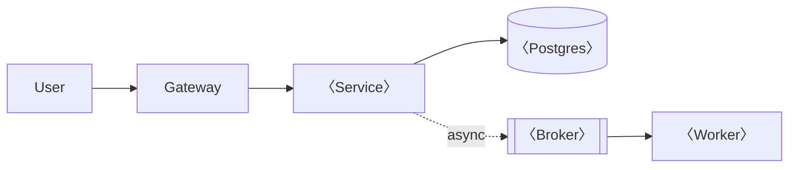

# Writing the design doc

## When to use this

Run the trigger test. Write a doc if **any** are true:

- More than one person touches it
- It'll take more than ~3 months, or run for years
- It contains a decision that's **expensive or irreversible** to undo

If none are true → **skip the doc and write the code.** A doc nobody needed is
pure cost.

**Not this skill if:** it's a bug fix, a cheap-to-reverse tweak, or an
already-decided implementation. Just do it.

## The governing filter: penalty for being wrong

> Spend design effort in proportion to the **cost of being wrong.**

| Expensive to reverse — **design these** | Cheap to reverse — **just pick one** |
|---|---|
| Storage engine / schema shape | A library version |
| Service boundaries | A button label |
| Sync vs async coupling | Log format |
| Auth model | Which email vendor |
| Language / runtime for a core tier | Internal function naming |
| Public API contract | Folder naming |

**Match depth to risk.** A one-pager and a 20-page doc are both valid outputs.
Do not fill in every heading out of obligation — delete what doesn't apply.
Empty ceremony is the failure mode here.

## Procedure

### 1. Right-size it

〈one-pager | full template at `docs/design-doc-template.md`〉 — choose based on the
trigger test, and say which you chose.

### 2. Write the decisions, not the narrative

For each **expensive** decision, record exactly three things:

- **Chosen:** what, and the *one* reason that actually drove it
- **Rejected:** the real alternative, and the specific reason it lost
- **Reversal cost:** what it takes to undo this in 6 months

The **rejected** line is the part that gets reviewed and the part that saves the
next person. A doc that only records what you chose is a press release.

### 3. Record the architectural rung

State the rung (`0` script → `2` modular monolith → `3` a few services → …),
and:

- **Why not the rung below:** the specific failure mode it hits
- **Why not the rung above:** the complexity tax you're declining to pay

Default to the **lowest rung that works**. Stopping early is a win.

### 4. Diagram it

**Mermaid**, in the markdown — editable and diffable. Never a screenshot.
If a flow has ≥3 hops or a branch, it needs a diagram.

Mark **sync vs async** edges distinctly — that distinction is the single most
load-bearing thing on the diagram.

### 5. Cover the cross-cutting constraints

These are **not tradeable axes** — a design that trades them away has an earlier
mistake in it:

- [ ] **Security** — trust boundaries; where untrusted becomes trusted
- [ ] **Observability** — if it breaks, how do you find out? if it's abused, where's the record?
- [ ] **Cost** — spend shape; budget for anything external/paid
- [ ] **Scale** — vertical or horizontal, stated deliberately; statelessness checked if horizontal
- [ ] **Testing** — how is this verified? (evals, if it's non-deterministic)

### 6. Milestones

Each milestone must produce something **checkable** — a demo, a passing test, a
measurement. "Phase 1: build the backend" is not a milestone.

## Definition of done

- [ ] Right-sized (trigger test applied; unused sections deleted, not left blank)
- [ ] Every expensive decision has **chosen + rejected + reversal cost**
- [ ] Rung recorded, with why-not-below and why-not-above
- [ ] Mermaid diagram, sync/async edges distinguished
- [ ] Security / observability / cost / scale / testing addressed
- [ ] Milestones are individually checkable
